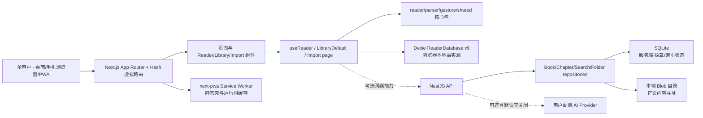

# PHASE-01 当前架构与事实源审计

- Goal：GOAL-READING-WORLD-V1
- 控制修订：REV-0001
- 代码基线：`c900af34e81d5b09319498f57953bf2c0205c02c`
- 审计日期：2026-08-13（Asia/Shanghai）
- 结论：现有 Monorepo 可演进复用；GATE-01 之前不得扩张。本文只描述当前事实，不证明 Goal 或任一终局承诺完成。

## 1. 实际运行拓扑

当前不是一套统一数据库的前后端应用。浏览器 Dexie 是离线阅读、书架、章节、进度、书签/笔记、导入任务和本地 AI 配置的主要事实源；Nest/SQLite/Blob 是分享口令隔离的可选服务端数据面。两者尚无版本化同步协议，也不是同构数据模型。

## 2. 页面、调用链与事实源

| 用户入口 | 主要实现 | 核心依赖 | 当前写入点 | 当前事实判断 |
|---|---|---|---|---|
| 应用外壳/虚拟路由 | `apps/web-pwa/src/app/page.tsx`、`components/AppShell.tsx`、`lib/route-store.ts` | localStorage 路由快照 | localStorage | App Router 只承载根页面，业务页主要由 Hash/虚拟路由调度；可复用但增加路由与离线验证复杂度。 |
| 书架 | `app/library/LibraryDefault.tsx`（3614 行） | Dexie live query、API books/folders、目录授权 | Dexie + 可选 API + localStorage 同步任务标记 | 能展示、导入、目录扫描与上传/下载，但职责高度集中；“同步任务”仅 UI 状态，不是加密同步。 |
| 导入/预览 | `app/import/page.tsx`（1188 行）、`parser.worker.ts`、`PreviewClient.tsx` | parser-core、FolderScanService | Dexie books/chapters/importTasks/source tables | TXT/EPUB/目录/合法 URL 有候选入口；当前 E2E 只新鲜证明小型 UTF-8 TXT。大文件、失败恢复与真实 EPUB 未证明。 |
| 阅读器 | `hooks/useReader.ts`（2624 行）、`ReaderClient.tsx`、reader components | reader-core、gesture-core、reader settings | Dexie progress/bookmarks/chapters/books | 当前小型 TXT 的阅读、书签、刷新已通过 Chromium 回放；进度写入分散，1 秒、崩溃、断网与精确锚点未形成 GATE-01 证据。 |
| 笔记 | `app/notes/page.tsx`、`features/notes/notes-filter.ts` | Bookmark.note | Dexie bookmarks | 笔记与书签共表；列表/筛选有候选实现，Markdown/JSON 人读导出缺失。 |
| 搜索 | `app/search/page.tsx`、API SearchRepository | Dexie 本地书目 + SQLite FTS5 | Dexie / SQLite | 本地和远端结果可合并；规模、稳定去重、合法 Provider 边界待验证。 |
| 设置/AI | `app/settings/page.tsx`、`lib/reader-settings.ts`、`lib/ai-config.ts` | localStorage + Dexie 加密字段 + API AI | localStorage / Dexie | 阅读设置存在；AI 非核心入口存在，但“默认关闭、外发预览、按书禁用、清缓存”未完整证明。 |
| PWA | `next.config.mjs`、`ServiceWorkerRegistration.tsx`、`public/manifest.json` | next-pwa/Workbox | Cache Storage | 有生产缓存候选和历史离线回放；当前普通 build 会改写受控 `public/sw.js`，真断网冷启/升级/配额仍需 PHASE-06 新鲜证据。 |
| API | `apps/api/src/app.module.ts` 与 modules | NestJS、Drizzle schema、libSQL client | SQLite/Blob | 书、章、搜索、目录、URL 解析和 AI 端点存在；没有备份、设备、密钥、密文同步或恢复 API。 |

## 3. 数据模型事实

### 3.1 浏览器端

`packages/storage-core/src/db.ts` 定义 `ReaderDatabase`，当前最高版本为 v9，表包括：

- `books`、`chapters`、`progress`、`bookmarks`；
- `importTasks`、`librarySources`、`libraryFolders`、`indexedNovelFiles`、`txtChapterIndices`；
- `aiViews`、`aiUserConfigs`。

现有 `backupMetadataToStorage()` 只把书目、进度和书签写入 localStorage，并在超过 100 本书或 500 条书签时裁剪；它不包含章节、来源、设置、导入状态、AI 配置，也没有公开版本、校验和、预览、合并/副本恢复契约。代码中的 Capacitor/Tauri 分支依赖运行时桥，但仓库内两个“原生”目录没有可构建宿主配置，不能当作已交付备份能力。

### 3.2 服务端

`apps/api/src/modules/database/schema.ts` 与 `database-bootstrap.ts` 定义 `books`、`library_folders`、`chapters`、`storage_objects`、`ai_views` 与 FTS5。启动准备会事务性去重章节并建立 `(book_id, index)` 唯一索引，但只有增列式准备逻辑，没有显式 schema version、迁移清单、迁移前备份或上一稳定版读取合同。

`x-share-token` 通过 ID 后缀隔离数据，是历史单机分享隔离机制，不是身份系统，也不是 E2EE 设备授权协议。服务端当前存储可读书名、元数据和正文 Blob；在 GATE-02 前不得把它描述成“服务端只见密文”。

### 3.3 契约分裂

| 语义 | Dexie | SQLite/API | 缺口 |
|---|---|---|---|
| 阅读进度 | 独立 `progress` 表，结构化字段 | `books.last_read_progress` JSON 字符串 | 无统一版本、冲突规则与幂等键。 |
| 书签/笔记 | `bookmarks`，笔记为可选字段 | 无表/无 API | 无法完整同步或服务端备份。 |
| 设置 | localStorage 与 Dexie AI config | 无正式契约 | 不可携带、不可版本迁移。 |
| 正文 | Dexie chapter content | SQLite content hash + Blob | 无统一内容指纹和密文封装。 |
| 来源/目录 | 多张浏览器表 | 仅 library_folders | 权限/设备路径语义不同，不能直接同步。 |

因此 PHASE-02 首要工作不是新增功能，而是冻结最小版本化本地数据契约和兼容适配器，用固定 TXT 完成 GATE-01。

## 4. 可复用边界

| 结论 | 模块 | 理由 |
|---|---|---|
| 直接复用并加强测试 | `shared-types`、`reader-core`、`parser-core`、`gesture-core` | 已有纯逻辑边界和 91 个新鲜单测（20+52+9+10）。 |
| 复用外观、重收领域入口 | AppShell、Reader 组件、UI tokens/themes | 当前风格符合用户方向，组件可保留；状态与副作用应从页面/巨型 Hook 提取。 |
| 兼容迁移后替换 | `storage-core/db.ts`、`useReader.ts`、`LibraryDefault.tsx`、导入页 | 含真实能力但耦合和写入点过多；禁止一次性推倒，按纵切片提取。 |
| 保留为可选服务边界 | Nest modules、repositories、SQLite/Blob | 可承载自托管密文与设备状态，但现模型不能直接升级为 E2EE 真相源。 |
| 历史非目标，隔离/移除候选 | `apps/mobile-capacitor`、`apps/desktop-tauri` | 只有跟踪的静态导出副本，无 `package.json`、Capacitor 配置、Cargo/Tauri 配置；违反 NREQ-01 的认知风险大于价值。 |

## 5. 测试与运行事实

机器证据位于 `reports/phase-01-baseline.json` 及同名 `.records/`：

- Web lint 通过；API ESLint 以无 `--fix` 命令通过；
- 工作区测试通过：AI 4、Gesture 10、Shared Types 20、Reader 52、Storage 6、Parser 9、Web 42、API 31，共 174 个断言；
- 工作区 build 命令退出 0，Web 根路由 First Load JS 约 137 kB；
- 以系统 Chrome 151 运行 Playwright，当前 7/7 通过：小型 TXT 导入/书签/刷新、分享口令隔离、五档视口；
- 总基线仍为 FAIL：`next-pwa` 以 `dest: "public"` 在 build 中改写受版本控制的 `apps/web-pwa/public/sw.js`。检查器捕获后已把工作树补偿回 BASE 内容；该问题应在 PHASE-06 修正生成边界，不能用退出码 0 掩盖。

首轮 E2E 因缺少 Playwright v1228 浏览器失败，已保存在 `reports/history/phase-01-baseline-attempt-01/`。锁定浏览器下载随后因上游超时退出 130；系统 Chrome 151 的差异化环境验证通过。这些是环境诊断记录，不计入 GATE-01 的 EXP-01/02/03。

## 6. 当前风险排序

1. **P0 数据可信度**：Dexie/SQLite 契约分裂；现备份为可裁剪元数据快照，不是完整备份；迁移无版本化回滚合同。
2. **P0 GATE-01 缺口**：没有一条新鲜自动旅程同时证明 1 秒落盘、真断网、最小完整备份与隔离恢复。
3. **P1 写入集中**：`useReader`、书架和导入页面合计 7426 行，进度、章节、来源授权与 API 回退交织，容易形成竞态和伪成功。
4. **P1 PWA 可复算性**：build 改写受控 SW；现 E2E 使用 dev server，不能代替生产离线冷启和升级回放。
5. **P1 服务端边界**：现分享口令隔离不是设备授权；服务端仍见明文，E2EE/Docker compose/卷恢复均缺失。
6. **P2 工程卫生**：原生壳静态副本、跟踪的生成物和全仓安全扫描命中会污染范围判断与发布审计。

## 7. 控制结论与下一入口

- FACT-01、FACT-03 和 HYP-01 仍成立；未发现证伪 REV-0001 的事实，不请求新修订。
- 不把当前 E2E 7/7 外推为离线、备份或 Goal 完成；旧报告只作线索。
- PHASE-01 可在能力矩阵和独立复审落盘后收束；下一入口保持 PHASE-02 / TASK-0201。
- PHASE-02 只能做 EXP-01 所需的最小版本化契约、统一进度写入口、真断网与备份恢复薄切片；GATE-01 通过前不扩张 PHASE-03~06。
