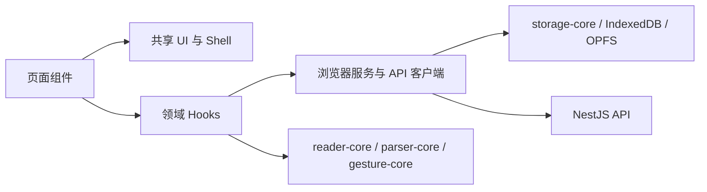

# 墨问全面升级设计规格

> [!IMPORTANT]
> 本规格基于 2026-07-10 的代码、设计交接文档、生产构建记录与桌面/移动端活体页面。用户已明确选择“B. 强国风沉浸叙事”，并授权在后续选择时自动采用推荐方案持续推进。

## 结论摘要

本轮不把墨问改成内容商城、社交产品或重型云平台。升级围绕同一条北极星路径展开：

```text
导入一本书 -> 看懂解析结果 -> 开始阅读 -> 稳定续读 -> 记录与检索 -> 按需使用 AI
```

执行分为四个可独立验收的切片：

1. **真实化与统一基础**：移除硬编码修行数据、停止自动污染新书架、统一 Shell、Design Tokens、图标、字体、状态反馈和无障碍规则。
2. **主旅程升级**：重做书架首屏信息层级，收敛导入流程，优化阅读器控制、搜索、笔记、设置与 AI 面板。
3. **稳定性与模块边界**：修复历史重复章节，拆分书架同步与阅读器高风险职责，保留后端数据隔离和权限真相源。
4. **性能与验证门禁**：视图懒加载、移除远程字体依赖、接通真实 E2E、CI 与诚实审计，建立桌面/移动端性能预算。

## 背景与证据

### 产品背景

项目定位是本地优先的个人小说聚合阅读平台，第一阶段验证 TXT / EPUB 导入、章节解析、沉浸阅读、离线与续读。事实来源：

- `README.md`
- `UI/design-handoff-ai-dev-v1.0/01-product-context.md`
- `UI/design-handoff-ai-dev-v1.0/02-ui-principles.md`
- `docs/mvp_local_execution_docs_v0.1/00-mvp-local-baseline.md`

### 当前已确认问题

| 问题 | 代码或运行证据 | 用户影响 |
| --- | --- | --- |
| 书架和侧栏展示硬编码的 18 天、15/45 分钟、12 册等数据 | `AppShell.tsx`、`Sidebar.tsx`、`LibrarySimple.tsx` | 用户无法区分真实状态和装饰数据 |
| 新浏览器自动写入三本预置书 | `LibraryDefault.tsx` 的 `library-auto-initialized` | 空状态永远不可见，个人书架被产品样例污染 |
| 根页面同步导入全部业务视图 | `app/page.tsx` | 初始客户端代码包含非当前页面逻辑，降低加载速度 |
| 书架、导入和阅读 Hook 分别约 3654、1085、2608 行 | 对应源码行数 | 修改风险高，难以针对单一职责测试 |
| `AppShell`、`PageLayout`、`Sidebar` 存在重复导航与滚动记忆 | 对应组件实现 | 页面风格与行为容易分叉 |
| 全局禁止文本选择，且字体样式从多个外部 CDN 重复加载 | `globals.css`、`layout.tsx` | 可访问性受损，离线与首屏稳定性下降 |
| 后端发现历史重复章节后跳过唯一索引 | API 启动日志与 `database.module.ts` | 同一本书同一序号可能长期存在多章，查询结果不确定 |
| 阅读 E2E 文件未接入脚本和 CI | `apps/web-pwa/e2e/reader.spec.ts`、包脚本、CI | 测试绿灯不能证明核心用户旅程可用 |
| 旧 PWA 审计脚本写死本机路径并输出“100% 完美”结论 | `scripts/audit-pwa.js` | 验证结果不可复现，容易形成假绿 |

## 方案选择

| 方案 | 用户价值 | 成本与风险 | 结论 |
| --- | --- | --- | --- |
| A. 克制的中文阅读器 | 理解门槛最低 | 品牌张力弱于当前产品方向 | 备选，不采用 |
| B. 强国风沉浸叙事 | 品牌感最强，形成独特的中文阅读世界 | 需要严格控制信息密度、假数据和术语维护 | **采用** |
| C. 中性效率工具 | 最轻、最容易维护 | 与现有品牌和设计交接断层 | 不采用 |

视觉原则是“强国风、弱干扰、真数据”：宋体与楷体建立文学气质，暖白和炭黑负责大面积可读性，松柏绿负责主操作，天青负责同步与 AI，低饱和朱砂负责印章、警告和阅读进度。国风来自排版、材质、命名和节奏，不依赖大面积米黄、重阴影或装饰堆叠。

### 诗意语言系统

所有诗意术语集中在一个可测试的产品词典，不允许页面各写一套近义文案：

| 诗意标签 | 白话含义 | 使用边界 |
| --- | --- | --- |
| 纳书入阁 | 导入书籍 | 主按钮可使用；辅助说明和可访问名称写“导入书籍” |
| 继续展卷 | 继续阅读 | 仅在存在真实进度时出现 |
| 落墨 | 写笔记 | 按钮旁或 Tooltip 解释“写笔记” |
| 寻书 | 搜索书籍 | 导航可使用；搜索框仍写明确占位文案 |
| 笺注 | 笔记与书签 | 页面标题可使用；筛选和删除操作保持白话 |
| 云阁同步 | 同步数据 | 仅在绑定分享口令后出现 |

危险操作、权限、错误、隐私说明、恢复路径和数据迁移不得只使用隐喻。例如必须写“删除书籍及本地章节”，不能只写“焚卷”；必须写“文件夹授权已失效”，不能只写“书箧失联”。

## 范围与非目标

### 本轮范围

- 桌面浏览器、手机浏览器和可安装 PWA。
- 书架、导入、解析预览、阅读器、书籍详情、搜索、笔记和设置。
- 本地 IndexedDB / OPFS、NestJS / SQLite、本地文件存储、分享口令隔离与 AI 派生视图。
- 空、加载、错误、离线、权限丢失、同步冲突和历史数据迁移状态。

### 明确不做

- 账号、角色管理、社交、内容商城、广告或推荐流。
- 默认上传全文到第三方云端。
- 新增 Redux、Zustand、微前端或另一套路由框架。
- 为装饰目的新增 GSAP 运行时。当前交互只需要 CSS 合成层过渡；全部动效服从 `prefers-reduced-motion`。
- 一次性推倒自定义 Hash 路由。先通过视图懒加载和统一导航适配器减负，保留离线兼容性；原生 App Router 迁移需另立 ADR 和兼容性实验。
- 删除用户现有书籍，包括历史上自动写入的预置书。只停止新环境自动写入。

## 产品与页面设计

### 全局 Shell

- 桌面：窄侧栏提供书架、寻书、纳书、笺注、设置；内容区使用稳定顶部栏，并通过 Tooltip / 可访问名称给出白话含义。
- 手机：顶部只保留页面标题和当前页面主操作；底部导航使用短诗意标签，控件的可访问名称保持书架、搜索、导入、笔记、设置。
- 导航、滚动记忆、在线状态和响应式布局只有一个权威实现。
- 图标按钮使用 `lucide-react`，无可见文字的控件提供可访问名称和 Tooltip；印章、纸纹等品牌装饰不得承担唯一交互含义。
- 卡片圆角不超过 8px；继续阅读可使用一块有边界的功能区域，页面章节本身不做浮空卡片。

### 书架

首屏顺序固定为：

1. 紧凑页面标题与“纳书入阁”主操作，并附“导入书籍”白话说明。
2. 仅在存在进度时展示“继续展卷”；不存在进度时展示一句可操作引导。
3. 书架工具条：搜索、排序、视图模式和文件夹。
4. 真实书籍列表。
5. 同步状态仅在绑定分享口令、存在同步任务或发生错误时出现，不占用默认首屏。

新用户看到真实空状态，可选择“导入一本书”或“添加示例书”。示例书必须由用户主动添加。

### 导入与解析预览

- TXT、EPUB、URL 和文件夹入口保持同一页面，但默认只突出 TXT / EPUB 文件导入。
- 批量或文件夹能力放入“更多导入方式”，降低首次使用负担。
- 解析过程显示真实步骤、进度、取消与重试；失败文案说明原因和下一步。
- 解析预览保留书名、作者、章节标题编辑；章节删除必须可撤销或二次确认。
- 离开未完成任务时保留草稿，重新进入可恢复。

### 阅读器

- 默认进入沉浸正文，不展示全局底部导航。
- 手机点击区保持 25% / 50% / 25%，并避开文本选择、输入、按钮与系统手势。
- 桌面正文宽度维持 680-820px；目录和 AI 是可收起的辅助列。
- 字号、行高、段距、字距、主题、滚动/分页使用统一设置模型，修改实时生效。
- 菜单、抽屉和 Sheet 使用同一 Overlay 行为：Esc 关闭、焦点可见、关闭后恢复焦点、手机安全区可用。
- 逐字打印不再直接修改 React 管理节点；AI 结果使用稳定 React 状态，并在减少动效模式下直接显示。

### AI 阅读增强

- AI 是阅读辅助层，不是悬浮聊天机器人。
- 保留章节摘要和自由提问；增加“人物与关系”“关键线索”“术语解释”三个快捷意图，统一走现有章节问答接口。
- 不新增会改写原文的数据结构；AI 输出继续作为 `AIView` 或会话派生内容。
- 缓存键继续包含书籍作用域、正文哈希、模型和提示版本；不同意图使用不同提示版本，禁止串缓存。
- 没有配置、网络失败、模型拒绝和缓存命中分别给出明确中文状态。
- 用户自有 API Key 只在内存解密并发送给配置的后端；界面明确说明其传输目的，不把前端加密描述成服务端级秘密保管。

### 搜索、笔记、设置与详情

- 搜索默认查本地书架；远端后端搜索作为明确的第二来源，失败不影响本地结果。
- 笔记页只显示真实书签与笔记，支持按书和关键词筛选；移除无数据支撑的勋章与修行统计。
- 设置按“阅读、AI、存储与同步、界面、数据管理”分组；危险操作集中在底部并二次确认。
- 书籍详情优先显示继续阅读、目录、缓存/来源状态和删除入口，不添加推荐流。

## 架构与模块边界

### 前端边界



新增或收敛的权威入口：

| 边界 | 职责 |
| --- | --- |
| `components/app-shell/` | 导航、页面头部、移动底栏、在线状态和滚动恢复 |
| `components/ui/` | Button、IconButton、SegmentedControl、StatusNotice、EmptyState、Dialog |
| `features/library/` | 书架查询、同步任务、书籍操作和书架视图 |
| `features/import/` | 导入任务状态机、文件/URL/文件夹适配器和解析预览 |
| `features/reader/` | 阅读会话、位置恢复、设置、来源加载、AI 与书签 |
| `lib/navigation.ts` | 现阶段 Hash 路由的唯一适配器，页面不再自行拼接路由状态 |
| `styles/tokens.css` | UI 颜色、间距、圆角、阴影、层级与动效时长 |

拆分只发生在本轮触及的职责中，不做与用户旅程无关的目录重排。

### 后端边界

- Controller 只解析输入、提取分享口令并返回协议结果。
- Repository 负责分享作用域、数据库查询和事务。
- BlobStorage 继续负责正文二进制边界。
- 数据库初始化拆成可测试的 schema 准备与迁移函数。
- 分享口令由后端用于查询和写入隔离；前端显隐只是体验，不替代安全边界。

## 数据迁移与稳定性

### 重复章节迁移

启动迁移按 `(book_id, index)` 分组，保留 `created_at` 最新、`id` 字典序最大的记录，删除其余重复行，再创建唯一索引。迁移在事务中执行；失败时 API 不继续启动，避免在不确定约束下接受新写入。

迁移后按实际章节数回写 `books.chapter_count`。正文 Blob 不在本轮自动删除，避免误删仍被其他记录引用的数据；孤儿 Blob 清理另走受控垃圾回收。

### 同步与权限

- 自动同步只有在用户已绑定非默认分享口令且开启自动同步时运行。
- 每本书的上传/下载任务继续使用互斥锁和持久任务标记；损坏标记必须自愈。
- 后端对所有书籍、章节、文件夹、搜索、进度和 AI 请求执行同一分享作用域过滤。
- 前端不得通过角色名或硬编码管理员逻辑开放能力。

### 错误策略

| 场景 | 用户界面 | 数据行为 |
| --- | --- | --- |
| 本地存储不可用 | 显示阻断状态和浏览器设置建议 | 不伪装保存成功 |
| API 离线 | 本地阅读继续，远端状态降级 | 不清空本地数据 |
| 导入失败 | 显示具体原因、重试和返回编辑 | 保留原文件与草稿 |
| 章节缺失 | 提供重新解析、重新授权或返回目录 | 不覆盖已有章节 |
| AI 失败 | 展示模型/配置/网络类别和重试 | 不写入失败缓存 |
| 数据迁移失败 | API 启动失败并输出可执行诊断 | 不跳过完整性约束 |

## 性能、动效与无障碍预算

### 性能预算

- 根页面不再静态导入全部业务视图；当前视图按需加载，PWA 构建继续预缓存生成的静态块。
- UI 不请求 Google Fonts、ElemeCDN 或 jsDelivr 字体 CSS；使用现有本地 Geist 和系统中文字体栈。
- 生产构建中 `/` 的 First Load JS 目标不超过 250 kB；若受 Next.js 基础包影响无法达到，必须记录构成和最小可行下限。
- 不新增动画、状态管理或图表运行时；唯一计划新增的前端运行时依赖是可摇树优化的 `lucide-react`。
- 340、390、768、1024、1440 和 1920px 视口不得出现页面级横向溢出。
- 书架列表按稳定 key 渲染；同步和筛选不在 render 阶段执行全库扫描。

### 动效规则

- 简单 hover、focus、Sheet 和抽屉使用 CSS `transform` / `opacity`。
- 不动画 `width`、`height`、`top`、`left` 等高重排属性，必须变化布局时直接切换布局状态。
- `prefers-reduced-motion: reduce` 下关闭旋转、呼吸、逐字、缩放和模糊转场。
- 禁止常驻 `will-change`；只在真实动画期间使用。

### 无障碍规则

- 正文和普通页面默认允许文本选择；仅按钮、导航和拖拽手柄禁选。
- 所有交互使用 `button`、`a`、`input` 等语义元素，禁止用可点击 `div`。
- 焦点环对比清晰；图标按钮有名称；错误信息使用 `role="alert"` 或等价实时区域。
- 对话框支持 Esc、初始焦点、焦点约束和关闭后焦点恢复。
- 触控目标最小 44x44px，移动底栏包含安全区。

## 验证设计

### 自动化

1. 单元测试覆盖 Design Tokens、导航序列化、书架状态、同步任务标记、阅读位置、AI 意图缓存和数据库重复章节迁移。
2. Playwright E2E 使用独立临时 SQLite/Blob 目录，真实执行：
   - 首次打开看到空书架；
   - 上传 TXT；
   - 编辑解析预览并加入书架；
   - 打开阅读器、修改设置、保存书签和恢复进度；
   - API 离线后仍可读取已缓存章节；
   - 分享口令 A 无法读取分享口令 B 的书籍与章节。
3. CI 顺序固定为 `lint -> test -> build -> e2e -> audit --prod`。

### 活体复核

- 桌面与移动截图必须来自最新源码启动的服务，不复用旧服务或旧构建产物。
- 记录控制台错误、失败请求、页面溢出、关键元素遮挡和可交互状态。
- PWA 生产构建后验证 manifest、Service Worker、离线启动和已缓存章节。

## 完成定义

只有以下条件同时满足，才可称为本轮全面升级完成：

- 四个切片全部实现并分别提交。
- 无硬编码用户统计、无自动预置污染、无重复 Shell 真相源，诗意术语只来自单一产品词典。
- 历史重复章节迁移通过，唯一索引在测试库和现有本地库上真实存在。
- 主链路 E2E 在桌面与移动视口通过，且不因空书架而跳过。
- `lint`、全部单元测试、生产构建、E2E、`pnpm audit --prod` 和 `git diff --check` 全部通过。
- 最新桌面/移动截图无白屏、遮挡、页面级横向溢出或不可读文案。
- 任何未证明的远端部署状态明确标为“未验证”，不写成生产就绪。
